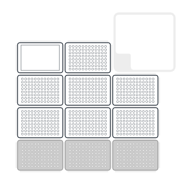

# primalpooling

Collection of Scripts for the OT2 for pooling primers

## Use case 

This is used when you have a 96-well PCR plate full of dry primers normalised to 10n moles. And want to resuspend / repool using an Opentron.

## Overview 

##### Constant locations 

`Top left`: This is a reservoir of TE. You can use the lid of a tip box. 

`Top middle`: Output plate. Each plate is combined down to a single column.

#### Per plate

Each plate you want to resuspend uses 3 positions, stacked on top of each other.

`Bottom`: The tip box for this plate.

`Middle`: The stock plate, containing the primers.

`top`: the aliquot plate. An empty PCR plate, which will contain a aliquot of each primer. 

#### How many plates

If you are resuspending just one plate. The tips should be in `bottom left`, stock plate in `1-from bottom left`, aliquot plate in `1-from top left`

