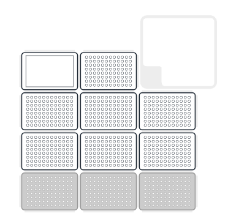

# primalpooling

Collection of Scripts for the OT2 for pooling primers

## Use case 

This is used when you have a 96-well PCR plate full of dry primers normalised to 10n moles. And want to resuspend / repool using an Opentron.

## Overview 

##### Constant locations 

`Top left`: This is a reservoir of TE. You can use the lid of a tip box. 

`Top middle`: Output plate. Each plate is combined down to a single column.

#### Per plate

Each plate you want to resuspend uses 3 positions, stacked on top of each other.

`Bottom`: The tip box for this plate.

`Middle`: The stock plate, containing the primers.

`top`: the aliquot plate. An empty PCR plate, which will contain a aliquot of each primer. 

#### How many plates

If you are resuspending just one plate. The tips should be in `bottom left`, stock plate in `1-from bottom left`, aliquot plate in `1-from top left`.

Two plates, should be the same as one plate with the addition of a new tip box in `bottom middle`, `1-from bottom middle`, aliquot plate in `1-from top middle`.

Three plates (Shown on plate) should have the right column also fill.

### Methods

The protocol will. For each column in a stock plate; 
- Take a column of tips from the tip box.
- Dispense 100ul of TE into the column.
- Return tips to column. 
- Repeat for next column.

The intentional wait here to let the primers rehydrate.

For each row;
- Using the same column tips, it will pipette mix the stock plate. Then transfer 20ul into the column of the aliquot plate, and 5ul to the output plate.

The whole plate will be output to the same output column. 